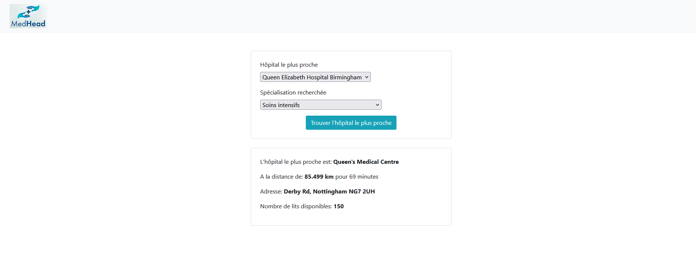

# MedHead Consortium - Proof of Concept (PoC)

## Description

Ce projet est une preuve de concept pour le consortium MedHead. Il s'agit d'une application de gestion des lits d'hôpitaux et des spécialités médicales dans un contexte d'intervention d'urgence, développée pour démontrer l'architecture cible en utilisant des technologies robustes telles que Spring Boot pour le backend, Angular pour le frontend, et MySQL comme base de données.



## Table des matières

- [Technologies Utilisées](#technologies-utilisées)
- [Prérequis](#prérequis)
- [Installation](#installation)
- [Structure du Projet](#structure-du-projet)
- [Exécution de l'Application](#exécution-de-lapplication)
- [Tests](#tests)
- [Pipeline CI/CD](#pipeline-cicd)

## Technologies Utilisées

- **Backend**: Spring Boot, Java 21, Maven 3.8.8
- **Frontend**: Angular
- **Base de données**: MySQL
- **Sécurité**: API Key via Header (`X-API-KEY`)
- **Tests**: JUnit, Mockito
- **CI/CD**: Jenkins
- **Stress Testing**: JMeter

## Prérequis

- **JDK**: Version 21.0.2
- **Maven**: Version 3.8.8
- **Node.js**: Version 18.x (pour Angular)
- **Angular CLI**: Version 15.x
- **MySQL**: Version 8.x
- **JMeter**: Version 5.5 ou supérieur
- **Jenkins**: Version 2.319.3 ou supérieur avec Maven 3.8.8 and JDK 21.0.2

## Installation

### Cloner le dépôt

```bash
git clone https://github.com/kilianpelissier/P11-repository-code.git
cd P11-repository-code
```

Configuration de l'environnement

    Backend : Configurer votre base de données MySQL avec les paramètres suivants dans application.properties :

```bash
spring.datasource.url=jdbc:mysql://localhost:3306/medhead_db
spring.datasource.username=root
spring.datasource.password=password
spring.jpa.hibernate.ddl-auto=update
```
Un fichier SQL avec un jeu de données est disponible dans Backend\api\src\main\java\com\medhead\api\data.sql


    Frontend : Naviguez vers le répertoire Frontend et installez les dépendances Angular :

```bash
    cd Frontend/medhead
    npm install
```

## Structure du Projet

```plaintext

├── Backend/
│   ├── api/
│   │   ├── src/
│   │   ├── stress_tests/
│   │   ├── pom.xml
│   │   └── ...
├── Frontend/
│   ├── src/
│   ├── angular.json
│   └── ...
└── deploy/
    └── pipeline

```

## Exécution de l'Application
**Backend**

Pour exécuter le backend Spring Boot :

```bash
cd Backend/api
mvn spring-boot:run
```

L'API sera disponible à l'adresse http://localhost:9000.

**Frontend**

Pour exécuter l'application Angular :

```bash
cd Frontend/medhead
ng serve
```

Le frontend sera disponible à l'adresse http://localhost:4200.

## Tests
**Tests Unitaires Backend**

Les tests unitaires sont implémentés avec JUnit et Mockito.

Pour les exécuter :

```bash
cd Backend/api
mvn test
```

## Pipeline CI/CD

Le projet utilise Github Actions pour l'intégration continue et le déploiement.

Le frontend et backend sont testés avant d'être build et push sur dockerhub afin d'etre réutilisable partout:

https://hub.docker.com/r/kilianpelissier/medhead-poc-frontend
https://hub.docker.com/r/kilianpelissier/medhead-poc-backend